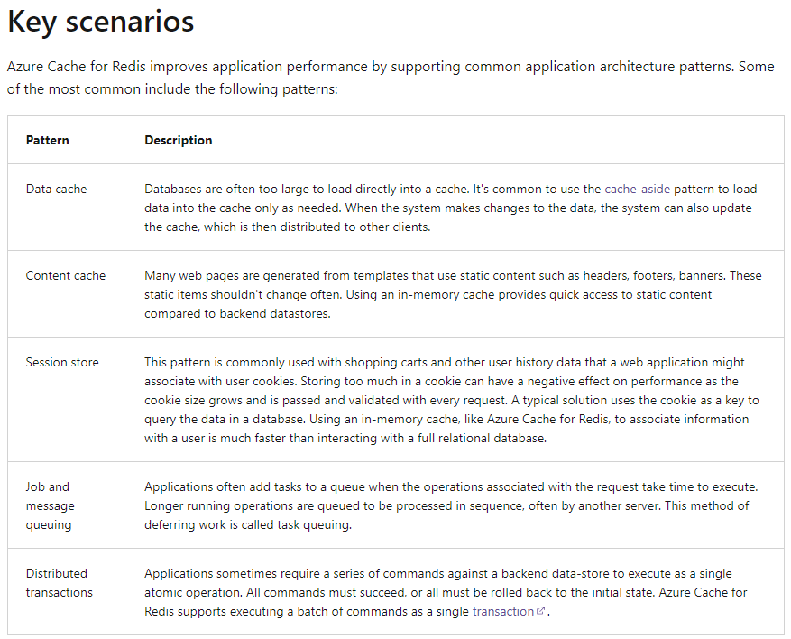
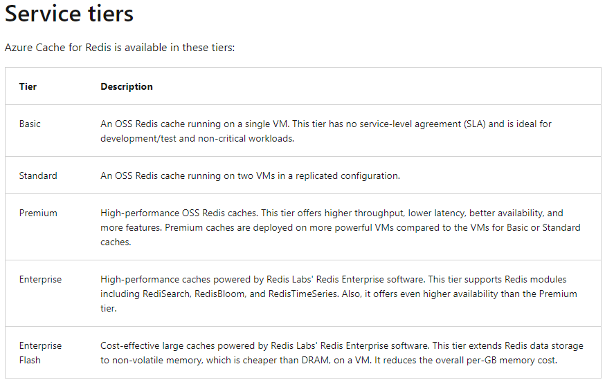
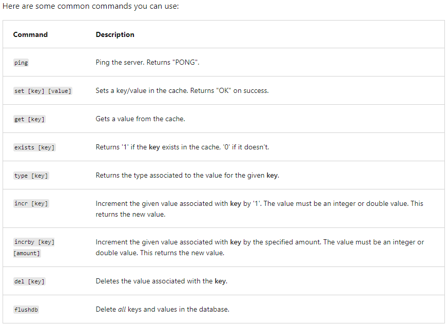

# Explore Azure Cache for Redis
Azure Cache for Redis provides an in-memory data store based on the Redis software.
Azure Cache for Redis offers:
- **Redis open-source (OSS Redis)** 
- **Redis Labs (Redis Enterprise)** as a managed service

## Configure Azure Cache for Redis
- Put the Redis cache as close to the data consumer as you can
- Three pricing tiers available for an Azure Cache for Redis:
  - **Basic**: 
    - Basic cache ideal for development/testing
    - There is no SLA for this service tier
    - single node
    - up to 53 GB of memory, and 20,000 **simultaneous** connections
  - **Standard**: 
    - Production cache which supports replication and includes an SLA (99.9% availability)
    - 2 replicated nodes
    - up to 53 GB of memory and up to 20K **simultaneous** connections
  - **Premium**: 
    - Enterprise tier which builds on the Standard tier and includes persistence, clustering, and scale-out 
      cache support
    - 99.95% availability
    - low latency
    - up to 1.2 TB of memory and 40,000 **simultaneous** connections
  - **Enterprise** -> yes, some of the numbers are higher than the Enterprise flash
    - 99.99% availability
    - support for Redis time series, Redis search and Redis bloom
    - suports active geo-replication instead of just passive
    - up to 14 TB for cache size
    - up to 2000K **simultaneous** connections
  - **Enterprise flash** -> yes, some of the numbers are smaller than the Enterprise tier
    - 99.99% availability
    - **does not support** for Redis time series, Redis search and Redis bloom
    - fast non-volatile storage
    - up to 14 TB for cache size
    - up to 150K **simultaneous** connections
- Redis cache uses encryption by default
- You can scale from Basic to Standard to Premium etc..., but you can't scale down
- You can control the amount of cache memory available on each tier by choosing a cache level 
  from C0-C6 for Basic/Standard and P0-P4 for Premium
- The Premium tier allows you to persist data in two ways to provide disaster recovery:
  - RDB persistence takes a periodic snapshot and can rebuild the cache using the snapshot in case of failure.
  - AOF persistence saves every write operation to a log that is saved at least once per second. This creates bigger files
    than RDB but has less data loss
- Some benefits of using the premium tier:
  - you can deploy the cache to a virtual network in the cloud and the cache will be available to only other virtual machines
    and applications in the same virtual network.
  - you can implement clustering to automatically split your dataset among multiple nodes:
    - maximum 10 shards
    - te cost incurred is the cost of the original node, multiplied by the number of shards

## Accessing the Redis instance
- Redis has a command-line tool for interacting with an Azure Cache for Redis as a client

## Managing TTL in Redis
- by default, the data has no implicit expiration date. A TTL must be specified, otherwise, the data can stay forever,
  or until manually expired
- when the TTL elapses, the key is automatically deleted, exactly as if the DEL command were issued. Here are some notes
  on TTL expirations:
  - Expirations can be set using seconds or milliseconds precision
  - The expire time resolution is always 1 millisecond
  - Information about expires are replicated and persisted on disk, the time virtually passes when your Redis server 
    remains stopped (this means that Redis saves the date at which a key will expire)
- cache eviction 
  - basically, when the cache is full, it needs to remove entries, so that it can continue working
  - eviction policies:
    - **volatile-lru** - items that have a TTL, least recently used. It is the **default policy**
    - **allkeys-lru** - even items that don't have a TTL, least recently used
    - **noeviction** - obvious
    - **volatile-random** - anything that has a TTL and is considered volatile
    - **allkeys-random** - anything in the cache (including non TTL items) and is considered volatile
    - **volatile-ttl** - remove based on the smallest remaining TTL

## Best practices
- set the maxmemory-reserved setting - in case you're doing lots of writes. The documentation recommends to start with 10% of the cache
- reuse client connections
- use Redis pipelining
- try to store smaller values - break apart large data into smaller parts - better performance for the cluster
- set expiry times to manage content lifetime
- add jitter to spread database load
- avoid caching large objects
- host redis as close as possible to your application

## Caching patterns
- Cache aside pattern (Database caching)
  - classic caching
- Content caching pattern
  - similar to CDN
- User session caching pattern
  - example: maintain application state (shopping cart - user closes the browser then comes back and sees the same thing)
  - there are usually done using session cookies, but there are downsides to the cookies approach (limited data storage, slow performance)
- Jobs and message queuing
- Distributed transactions

## Configuring Redis cache
- estimate cache size
  - number of objects in the cache
  - size of cached objects
  - number of requests to the cache
  - cache expiration policy
- use the Redis benchmark utility that allows to simulate load on a Redis cache `Redis-benchmark -q -n -1000`